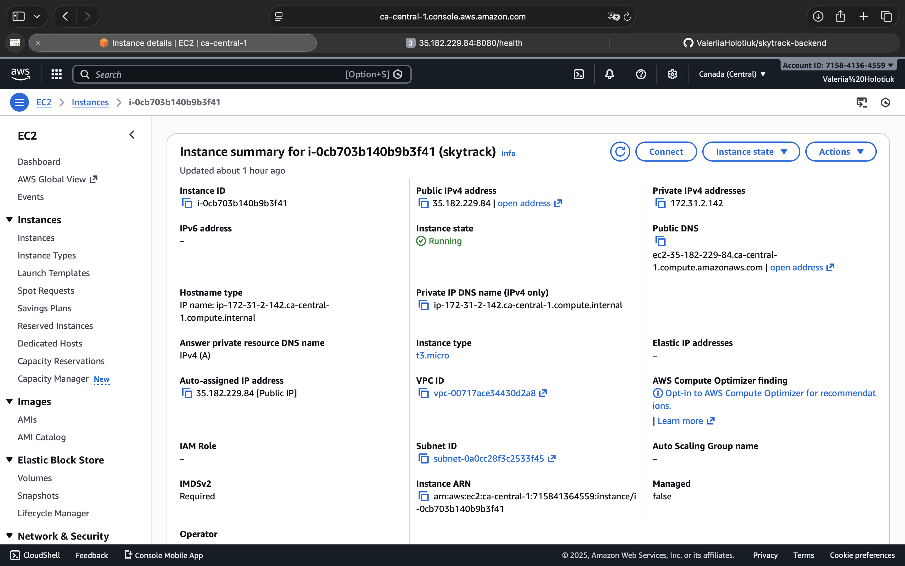
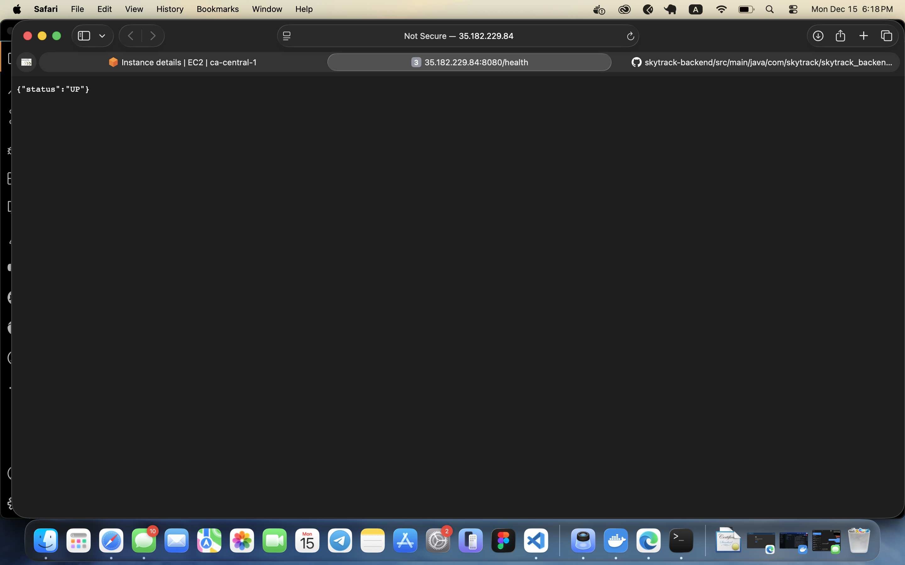
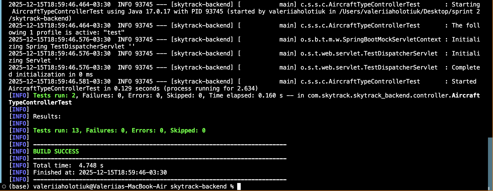
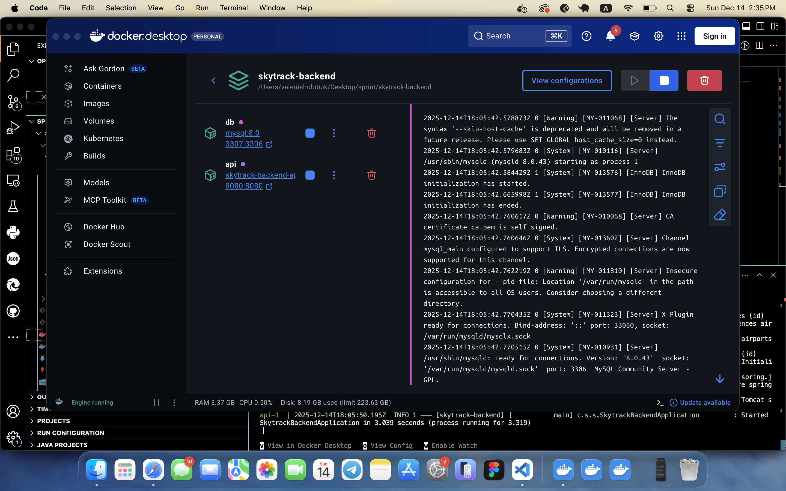

# SkyTrack Backend

Backend service for the SkyTrack full-stack application.

## Project Description
This is a Spring Boot REST API used to manage flight tracking data including airports, flights, airlines, and gates.  
The backend is designed using clean code principles and follows a RESTful architecture.

## Tech Stack
- Java
- Spring Boot
- Maven
- MySQL / PostgreSQL
- Docker
- GitHub Actions (CI)

## Team Members
- **Backend Developer:** Valeriia Holotiuk
- **Frontend Developer:** Ramadan Masadeh

## Git Workflow
- Main branch protected
- Feature branches used for development
- Pull Requests reviewed before merge
- GitHub Actions used to run tests on PRs

## Key Features
RESTful API built with Spring Boot (Java 17)
CRUD operations for:
-Airports
-Airlines
-Flights
-Gates
-Aircraft Types
MySQL database 
Docker 
Deployed on AWS EC2
Controller-level unit tests
Health check endpoint for deployment verification

## Project Structure
skytrack-backend/
├── src/
│   ├── main/
│   │   ├── java/com/skytrack/skytrack_backend/
│   │   │   ├── controller/
│   │   │   ├── service/
│   │   │   ├── repository/
│   │   │   ├── entity/
│   │   │   └── SkytrackBackendApplication.java
│   │   └── resources/
│   │       ├── application.properties
│   │       └── application-docker.properties
│   └── test/
│       └── java/com/skytrack/skytrack_backend/controller/
├── Dockerfile
├── docker-compose.yml
├── pom.xml
└── README.md

## Running the Docker
git clone https://github.com/ValeriiaHolotiuk/skytrack-backend.git
cd skytrack-backend
docker compose up -d --build
 
Verify:
curl http://localhost:8080/health

{ "status": "UP" }

## AWS EC2 Deployment
The backend is deployed on an AWS EC2 instance using Docker

http://35.182.229.84:8080/health

Expected response:
{ "status": "UP" }

This endpoint confirms that:
-The EC2 instance is running
-Docker containers are active
-The API is accessible publicly

## Testing
Tests cover key controllers such as:
-Airport
-Airline
-Gate
-Aircraft Type
-Flight

Run tests:
./mvnw test

## Database
MySQL runs in a Docker container

## CORS Configuration

This backend uses **CORS (Cross-Origin Resource Sharing)** to allow the frontend application to communicate with the API.

Since the React frontend and Spring Boot backend run on different origins (different ports/domains), browsers would normally block these requests.

To handle this, CORS is enabled at the controller level using `@CrossOrigin`, allowing HTTP requests from the frontend during development and deployment.

Example:
@CrossOrigin(origins = "*")
@RestController
@RequestMapping("/api/airports")

